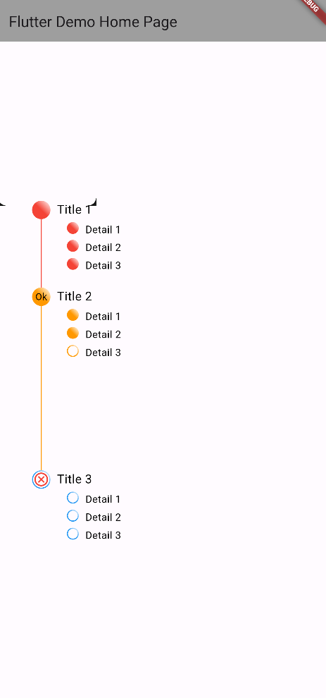
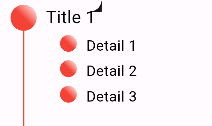
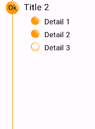
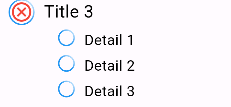

# Flutter Milestones

## Introduction

This Package let you create a milestone timeline with gradients points and a list of sub-details where each one can be set as reached/enabled or not. Each milestone can have the same color or a different one. You can custom colors and font sizes as you prefer. Also it's possible to set a Widget as child of the milestone point to include it as shown in the preview.

### [What's new?](https://github.com/Antwen97/flutter-milestones/blob/master/CHANGELOG.md)

## Features Preview



## Getting started

### Add dependency

Please check the latest version before installation.
If there is any problem with the new version, please use the previous version

```yaml
dependencies:
  flutter:
    sdk: flutter
  # add flutter_milestones
  flutter_milestones: ^{latest version}
```

## Usage

### Add the following imports to your Dart code

```dart
import 'package:flutter_milestones/flutter_milestones.dart';
```

### Parent Usage

```dart
Milestones(
    items: [],
),
```

### Child Usage Examples

#### 1. Red One

```dart
MilestoneElement(
    reached: true,
    title: 'Title 1',
    details: [
        (true, 'Detail 1'),
        (true, 'Detail 2'),
        (true, 'Detail 3')
    ],
    verticalDividerLength: 100,
    milestoneColor: Colors.red
)
```



#### 2. Orange One

```dart
MilestoneElement(
    reached: true,
    title: 'Title 2',
    milestoneChild: Text(
        'Ok',
        style: TextStyle(
            color: Colors.black
        ),
    ),
    details: [
        (true, 'Detail 1'),
        (true, 'Detail 2'),
        (false, 'Detail 3')
    ],
    milestoneColor: Colors.orange
)
```



#### 3. Blue One

```dart
MilestoneElement(
    reached: false,
    title: 'Title 3',
    milestoneChild: Icon(
        Icons.cancel_outlined,
        color: Colors.red,
    ),
    details: [
        (false, 'Detail 1'),
        (false, 'Detail 2'),
        (false, 'Detail 3')
    ],
    milestoneColor: Colors.blue
)
```



## Properties

### Parent Properties

| Property | Type | Default Value | Description                                         |
|----------|------|---------------|-----------------------------------------------------|
| items    | List | *default*     | The list of the `MilestoneElement` you want to show |

### MilestoneElement Properties

| Property              | Type                 | Default Value | Description                                                                                                                                                                                                                 |
|-----------------------|----------------------|---------------|-----------------------------------------------------------------------------------------------------------------------------------------------------------------------------------------------------------------------------|
| title                 | String               | Empty String  | The title of your milestone                                                                                                                                                                                                 |
| titleFontSize         | double               | 18            | The title font size                                                                                                                                                                                                         |
| reached               | bool                 | false         | The value that represent your milestone is reached or not and will color the container representing it                                                                                                                      |
| details               | List<(bool, String)> | Empty List    | The list representing the sub-points that can be set as reached or not and, in addition, the label to describe the sub-point itself                                                                                         |
| labelColor            | Color                | Colors.black  | the font color of the title and sub-points labels                                                                                                                                                                           |
| milestoneColor        | Color                | Colors.white  | The color of the title and sub-points containers. If specified without specifying the `milestoneGradient`, this color will be use in a LinearGradient with white Color to determinate the milestone and sub-points gradient |
| milestoneGradient     | Gradient             | null          | The gradient used to color the milestone and sub-points containers. If not specified, will be considered the `milestoneColor` param                                                                                         |
| milestoneChild        | Widget               | null          | The widget to show inside the milestone container                                                                                                                                                                           |
| verticalDividerLength | double               | null          | The length of each milestone trace to the next one                                                                                                                                                                          |

## Additional information

### Notes

The Package is under development and I'm opened to every idea that can improve its functionality.

### Support Me

If you would like to help me improving my work, just consider to buy me a coffee

 <a href="https://www.buymeacoffee.com/antwen"></a>
